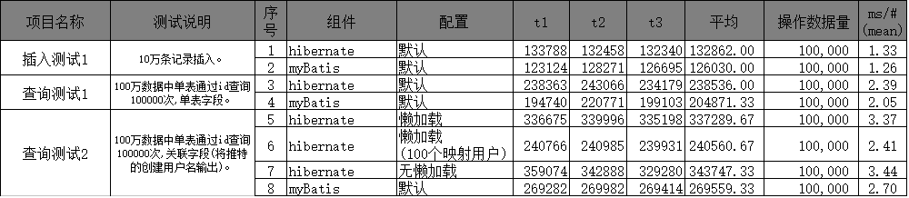

## 7.（选做）总结 Hibernate 与 MyBatis 的各方面异同点。

**PS：以下数据大部分源于网络**

对比数据源于：

https://www.zhihu.com/question/21104468

### #相同点

- Hibernate与MyBatis都可以是通过SessionFactoryBuider由XML配置文件生成SessionFactory，然后由SessionFactory 生成Session，最后由Session来开启执行事务和SQL语句。

- Hibernate和MyBatis都支持JDBC和JTA事务处理。

#### Mybatis优势

- MyBatis可以进行更为细致的SQL优化，可以减少查询字段。
- MyBatis容易掌握，而Hibernate门槛较高。

#### Hibernate优势

- Hibernate的DAO层开发比MyBatis简单，Mybatis需要维护SQL和结果映射。

- Hibernate对对象的维护和缓存要比MyBatis好，对增删改查的对象的维护要方便。

- Hibernate数据库移植性很好，MyBatis的数据库移植性不好，不同的数据库需要写不同SQL。

- Hibernate有更好的二级缓存机制，可以使用第三方缓存。MyBatis本身提供的缓存机制不佳。

#### 不同点

（1）hibernate是全自动ORM，而mybatis是半自动ORM。

（2）hibernate单表操作很轻松不需要自己手写SQL，mybatis需要维护xml，简单的SQL可以直接在mapper接口里写，复杂的则在对应的xml里写SQL。

（3）sql直接优化上，mybatis要比hibernate方便很多

#### 测试对比

**测试总结**
总体初观，myBatis在所有情况下，特别是插入与单表查询，都会微微优于hibernate。不过差异情况并不明显，可以基本忽略差异。
差异比较大的是关联查询时，hibernate为了保证POJO的数据完整性，需要将关联的数据加载，需要额外地查询更多的数据。这里hibernate并没有提供相应的灵活性。
关联时一个差异比较大的地方则是懒加载特性。其中hibernate可以特别地利用POJO完整性来进行缓存，可以在一级与二级缓存上保存对象，如果对单一个对象查询比较多的话，会有很明显的性能效益。
以后关于单对象关联时，可以通过懒加载加二级缓存的方式来提升性能。
最后，数据查询的性能与orm框架关无太大的关系，因为orm主要帮助开发人员将关系数据转化成对象型数据模型，对代码的深析上来 看，hibernate设计得比较重量级，对开发来说可以算是重新开发了一个数据库，不让开发去过多关心数据库的特性，直接在hibernate基础上进 行开发，执行上分为了sql生成，数据封装等过程，这里花了大量的时间。然而myBatis则比直接，主要是做关联与输出字段之间的一个映射。其中sql 基本是已经写好，直接做替换则可，不需要像hibernate那样去动态生成整条sql语句。
好在hibernate在这阶段已经优化得比较好，没有比myBatis在性能上差异太多，但是在开发效率上，可扩展性上相对myBatis来说好太多。

**PS：以上数据大部分源于网络**

对比数据源于：

https://www.zhihu.com/question/21104468