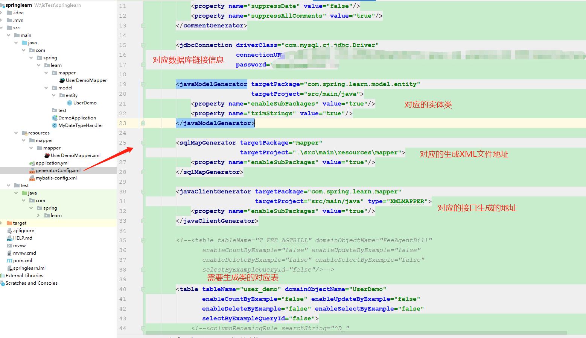
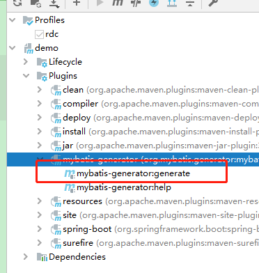
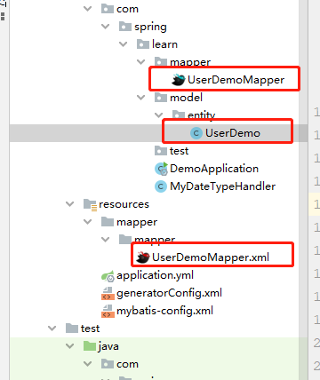
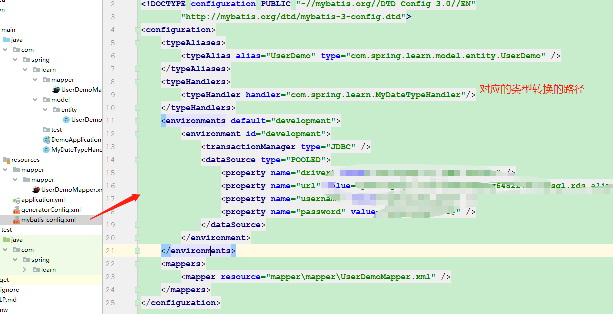
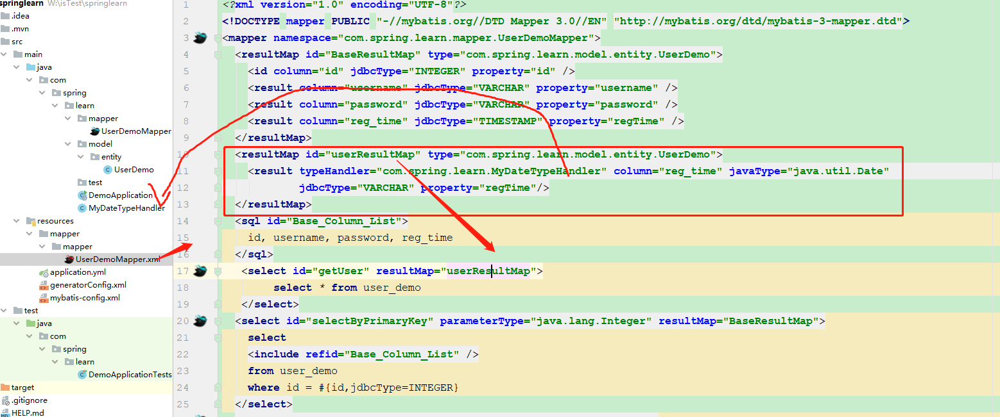
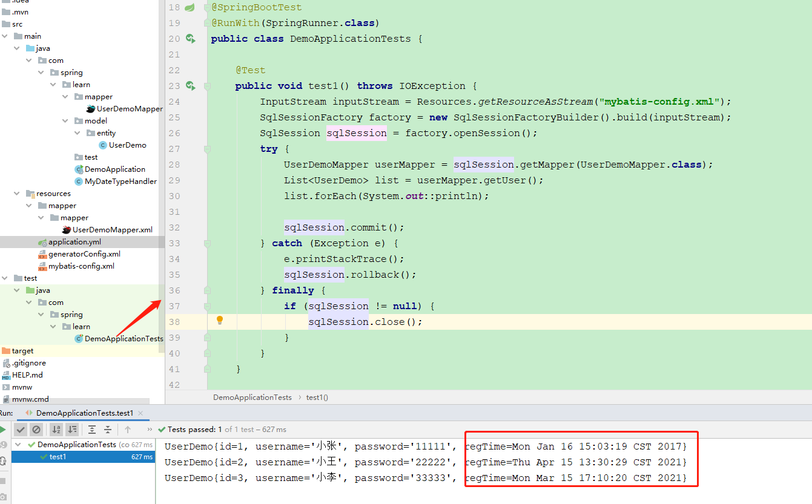

# 9.（选做）学习 MyBatis-generator 的用法和原理，学会自定义 TypeHandler 处理复杂类型。

PS：不是特别的会写文档，不要介意画风丑陋哈。

## 一：MyBatis-generator

1.先在POM倒入地址

```
<dependency>
            <groupId>org.mybatis.generator</groupId>
            <artifactId>mybatis-generator-core</artifactId>
            <version>1.4.0</version>
        </dependency>
```

并添加插件信息

```
<build>
        <plugins>
            <plugin>
                <groupId>org.mybatis.generator</groupId>
                <artifactId>mybatis-generator-maven-plugin</artifactId>
                <version>1.4.0</version>
                <dependencies>
                    <dependency>
                        <groupId>mysql</groupId>
                        <artifactId>mysql-connector-java</artifactId>
                        <version>8.0.23</version>
                    </dependency>
                </dependencies>
            </plugin>
        </plugins>
    </build>
```

2.填写generatorConfig.xml信息



3.在MAVEN使用插件

或者命令行输入

```
mvn mybatis-generator:generate -e
```



4.之后就能看到自动生成的数据了



## 二： 自定义 TypeHandler

说明：在文件里可以看到表结构的“reg_time”字段为varchar类型，默认添加的数据为时间戳的字符串

需求：对时间戳进行日期类型的转换。

1.先写mybatis-config.xml文件



2.填写类型转换的类MyDateTypeHandler

```
1.@MappedJdbcTypes定义的是JdbcType类型，这里的类型不可自己随意定义，必须要是枚举类org.apache.ibatis.type.JdbcType所枚举的数据类型。
2.@MappedTypes定义的是JavaType的数据类型，描述了哪些Java类型可被拦截。
3.在我们启用了我们自定义的这个TypeHandler之后，数据的读写都会被这个类所过滤
4.在setNonNullParameter方法中，我们重新定义要写往数据库的数据。
5.在另外三个方法中我们将从数据库读出的数据类型进行转换。
```

3.在UserDemoMapper接口里添加了List<UserDemo> getUser();

4.修改对应的XML



5.最后在测试类里测试数据

