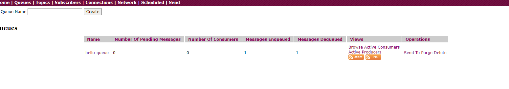

本周时间来不及 只写了2道必做题。


#### 第一题为redis的搭建


#### mq文件夹下的是第六题

**6.（必做）**搭建 ActiveMQ 服务，基于 JMS，写代码分别实现对于 queue 和 topic 的消息生产和消费，代码提交到 github。


docker 运行activemq 

```
docker run  -d -p 8161:8161 -p 61616:61616 -e ACTIVEMQ_ADMIN_LOGIN=admin -e ACTIVEMQ_ADMIN_PASSWORD=admin --name activemq webcenter/activemq:latest
```


新建了一个springboot项目；

导入POM 设置

```
<dependencies>
    <dependency>
        <groupId>org.springframework.boot</groupId>
        <artifactId>spring-boot-starter-activemq</artifactId>
    </dependency>
</dependencies>
```


添加Client端

```
@Component
public class HelloClient {
    
    @Autowired
    private JmsTemplate jmsTemplate;
    
    public void send(String message) {
        jmsTemplate.convertAndSend("hello-queue", message);
    }
}
```


添加Server端

```
@Component
public class HelloServer {
    @JmsListener(destination="hello-queue")
    public void receive(String message) {
        System.out.println(message);
    }
}
```


在启动类下添加文件 注入client 并且发送一个hello world

```
@SpringBootApplication
public class MqApplication {

    @Autowired
    private HelloClient helloClient;

    @PostConstruct
    public void init() {
        helloClient.send("hello world");
    }

    public static void main(String[] args) {
        SpringApplication.run(MqApplication.class, args);
    }

}
```


启动成功可以看到打印出的hello world

```
2021-06-20 23:10:14.018  INFO 18804 --- [           main] com.example.mq.MqApplication             : Starting MqApplication using Java 11.0.7 on DESKTOP-LIADQKV with PID 18804 (E:\development\geekbang\java-advance\Week_12\mq\target\classes started by AdminZz in E:\development\geekbang\java-advance\Week_12\mq)
2021-06-20 23:10:14.020  INFO 18804 --- [           main] com.example.mq.MqApplication             : No active profile set, falling back to default profiles: default
2021-06-20 23:10:14.804  INFO 18804 --- [           main] com.example.mq.MqApplication             : Started MqApplication in 0.995 seconds (JVM running for 2.816)
hello world

```


可以看到界面上已经处理了1次

